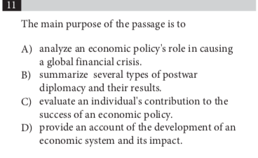

<notice>教程读者请不要直接阅读本文件，因为诸多功能在此无法正常使用，请移步至[程谱 coderecipe.cn](https://coderecipe.cn/learn/10)学习完整教程。如果您喜欢我们的教程，请在右上角给我们一个“Star”，谢谢您的支持！</notice>

Chapter 1 — Introduction to SAT Reading Test
======
在这一讲中我会具体讲到
1.	SAT阅读我们分几种题型，以及分几种文章类型。我们整个SAT阅读方法论的体系框架是先针对不同题型讲题型方法论，然后针对不同文章类型讲文章方法论，由点到线再到面，所以了解SAT阅读的题型分类方式和文章分类方式对我们之后的学习至关重要。
2.	怎么准备SAT阅读，我们会从词汇量，阅读量，和刷题量三个维度来详细分析SAT整体的备考策略。到底该刷什么题？词汇量要求是多少？如何提升自己的阅读量？这些都是我们在这一章要回答的问题。

Checkpoint 1 — SAT介绍
-----
接下来我们会通过下面这个视频介绍一下SAT阅读的组成和分类。

<cr type="player" parameters="XMzgzODc2MzkwMA=="><notice>播放器功能在此无法正常显示，请移步至[程谱 coderecipe.cn](https://coderecipe.cn/learn/10)查看。</notice></cr>

密码：R001

Checkpoint 2 — SAT介绍
-----
让我们检测一下大家的学习成果：

以上是哪种文章类型？
A.	Science 
B.	Social Science
C.	History
D.	Literature

正确答案：D

以上是哪种文章类型？
A.	Science 
B.	Social Science
C.	History
D.	Literature

正确答案：C

Checkpoint 3 — 题型巩固练习
-----

以上是哪种题目类型？
A.	循证题
B.	目的题
C.	双篇题
D.	主旨题

正确答案：B

以上是哪种题目类型？
A.	循证题
B.	目的题
C.	双篇题
D.	主旨题

正确答案：A

以上是哪种题目类型？
A.	循证题
B.	目的题
C.	双篇题
D.	主旨题

正确答案：D

Checkpoint 4 — SAT备考指南
-----
很多学生在备考SAT的过程中都有这样的问题：新SAT多少词汇量就够了？我需不需要读很多的英文原著来提升阅读量？新SAT什么题目可以刷？几乎在每一次考前我都会专门开一次讲座来讲这些备考的方法和注意事项。在接下来的视频中你们将找到这些问题的答案。

<cr type="player" parameters="XMzgzODc4NTcyMA=="><notice>播放器功能在此无法正常显示，请移步至[程谱 coderecipe.cn](https://coderecipe.cn/learn/10)查看。</notice></cr>
密码：R001

综上所述，大家可以放心做的题目有真题，OG，和PSAT真题，这些资料应该都可以在左边的资料区找到。

Checkpoint 5 — 重要注意事项
-----
请大家注意以下几点：

1. 我们所说的不要做普林斯顿，巴郎等SAT模拟题仅限于SAT阅读部分，至于语法和数学没有这个限制，因为是以考点为主。
2. 我们说到的加深单词理解一定是建立在已经有基本SAT泛读词汇量的基础上。如果连SAT单词都没有认全，那就不急着先开始去加深单词理解。简单来讲，先有了广度，才能去追求深度。

Checkpoint 6 — 学习工具和资料发放
-----

A.	Peer Insight 独家整理SAT核心单词表。这个单词表是专门针对SAT词汇题的，里面收录的都是非常常见和简单的词汇，但是却是这些词汇的英英解释，非常有助于对单词深度理解的加深。

[点击下载资源](https://pan.baidu.com/s/1VSUPpMD2I-OZ6pAU1ZXLlQ)
密码:u785

B.	Peer Insight 独家整理历史词汇表。这三个单词列表是Peer Insight 的教研组导师专门从美国18世纪中期以来的建国文献，名人演讲，著名政治历史书籍中摘录得到的近1500个单词，非常有助于加强对历史文章中常用词汇的深度理解，属于进阶版本。

[点击下载资源](https://pan.baidu.com/s/1PuBAHCBtqtYJ-Z2f4abL8Q)
密码:m22s

C.	Peer Insight 独家整理历史批注篇章。由Cameron亲自挑选的精品历史文章，短小精悍，和SAT历史文章常考的主题息息相关，非常适合历史文章的初学者阅读。是提升历史文章阅读水平的上佳读物。

[点击下载资源](https://pan.baidu.com/s/16ISrU32XK0qRxJ4JGp_xMQ)
密码:7m4e

