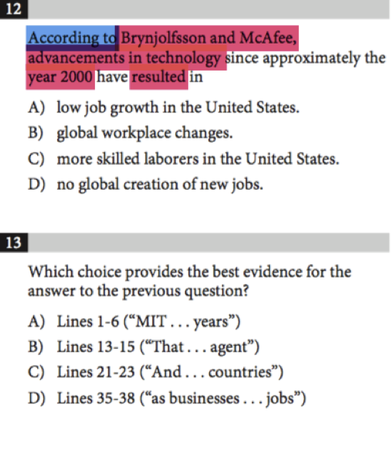
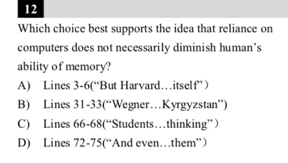
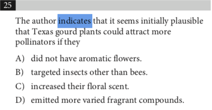
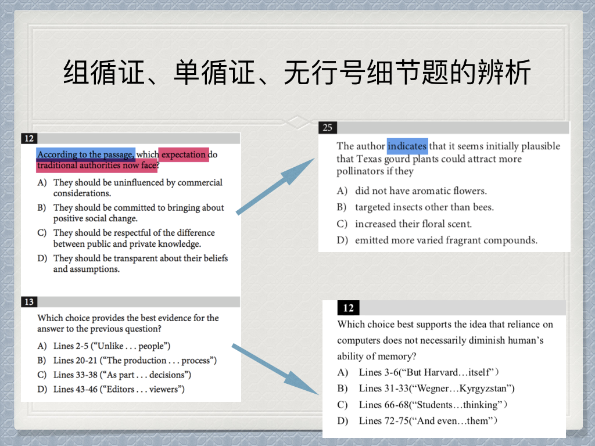
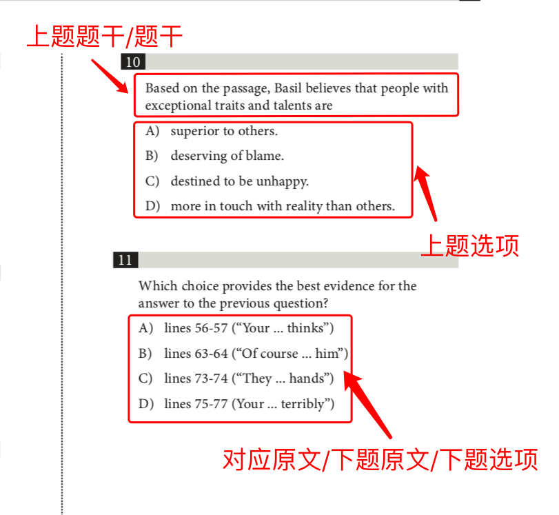

<notice>教程读者请不要直接阅读本文件，因为诸多功能在此无法正常使用，请移步至[程谱 coderecipe.cn](https://coderecipe.cn/learn/10)学习完整教程。如果您喜欢我们的教程，请在右上角给我们一个“Star”，谢谢您的支持！</notice>
Chapter 3 — 题型解题方法论：循证题（基础版）
======

前言
-----
在上一章中我们讲到了目的题，词汇题等等题型的解题方法论，但是大家不难发现，我们还差一种新SAT阅读最为重要的题目没有讲，那就是循！证！题！

循证题是新SAT阅读相比老SAT新增的题型，以一组题目的形式出现，又被叫做双黄蛋题目，或双胞胎题目。

循证题是新SAT阅读中出现频率最高的题目类型，每篇文章（注意，是每篇！）都会出两组左右的循证题。除此之外，循证题还有两种衍生题目，分别是单循证和无行号细节题，这三种题目加起来至少占到了SAT阅读题目的50%以上，可见学习循证题方法论的重要性。

组循证（我们平时说的循证题都是组循证）👇

单循证👇

无行号细节题👇

关系👇

不光如此，循证题在我们之后讲到文章的方法论中还会发挥至关重要的作用，所以这一章讲到的循证题方法论非常重要。那么接下来就请大家跟着我一起进入循证题的学习！

Checkpoint 1 — 循证题介绍
-----

首先，循证题都为一组题，分为上题和下题，上题提出一个和文章中一个细节的问题，下题四个选项是四段文章中的原文行号，你需要选出能找到上题答案的那一段原文。其目的是考察你是否是在文章中找答案的。循证题是新SAT Evidence-based reading test的最好证明，每一个问题的答案都可以在文章中找到，而不是靠所谓的对文章的感觉或猜测。

在观看方法论讲解视频之前，我们先来熟悉一下循证题中我们一般使用到的Jargon：

Checkpoint 2 — 循证题方法论入门
-----
循证题的解题方法我们可以用6个字来概括：上代下，下代上。

上代下指的是将上题的题干信息代入到下题四个选项中进行筛选，去掉不符合题干的原文；
下代上指的是将上一步筛选后剩下的选项带回到上一题中去，找到题干问题合适的答案。

<cr type="player" parameters="XMzgzODg2Njc3Ng=="><notice>播放器功能在此无法正常显示，请移步至[程谱 coderecipe.cn](https://coderecipe.cn/learn/10)查看。</notice></cr>

密码：R201

Checkpoint 3 — 循证题方法论训练例题
-----
刚刚接触非常抽象的上代下，下代上的方法论可能很多同学还不能一下子理解或掌握，不要着急，接下来我们再看两道例题的讲解。

<cr type="player" parameters="XMzg0MTI0MjExNg=="><notice>播放器功能在此无法正常显示，请移步至[程谱 coderecipe.cn](https://coderecipe.cn/learn/10)查看。</notice></cr>

密码：R202

Checkpoint 4 — 找对应时的注意点
-----
在上代下的过程中，我们要去筛选原文是否满足题干的限制条件，或者说，是否可以回答的上来题干提出的问题，但是在筛选原文的过程中，我们怎么判断这段原文是不是满足题干的限制条件呢？我们不是直接看这段原文中是不是出现了原文的关键词，而是看到这段原文的前句+本句来进行判断。

<cr type="player" parameters="XMzgzODg3Njk3Mg=="><notice>播放器功能在此无法正常显示，请移步至[程谱 coderecipe.cn](https://coderecipe.cn/learn/10)查看。</notice></cr>

密码：R203

但是大家要格外注意的是：上代下的过程中可以通过循证到原句的附近句子来判断是否满足题干，但是在下代上的过程中找对应一定要在循证到的原句中找。

Checkpoint 5 — 上代下，下代上方法的优越性
-----
相信很多同学在学习我们的循证题方法论之前都是按照顺序去做题的，按部就班的先做上题，再做下题，那么为啥我推荐大家用上代下，下代上的方法去做循证题而不是按照顺序呢？这种方法一定有它的优越性，接下来的视频中我就会给大家讲讲为什么我们要用这种方法，所谓知其然也要知其所以然。

<cr type="player" parameters="XMzgzODg3NzE4MA=="><notice>播放器功能在此无法正常显示，请移步至[程谱 coderecipe.cn](https://coderecipe.cn/learn/10)查看。</notice></cr>

密码：R204

Checkpoint 6 — 一个简单易懂的小例子
-----
讲了这么多循证题的方法论和具体的题目，大家应该对我们的方法论比较熟悉了，但是在开始下一章的循证题进阶前，我们还是用一个通俗易懂的例子来再次阐明循证题上代下，下代上的方法论。

<cr type="player" parameters="XMzgzOTM2OTY4OA=="><notice>播放器功能在此无法正常显示，请移步至[程谱 coderecipe.cn](https://coderecipe.cn/learn/10)查看。</notice></cr>

密码：R205
 
Checkpoint 7 — 总结
-----
我们最后对循证题解题方法做一个完整的总结。

当我们遇到一个循证题，做题步骤如下：
 
第一步—阅读上题题干，将题干改写成一个问题，注意不要漏过题干中的关键限制条件。

第二步—将题干转写成的问题代入到下题的四段原文中进行筛选，将可能可以给题干提供一个答案的原文留下，不能回答题干问题的删去。注意我们在判断原文是否满足题干的时候需要看一下附近的句子。

第三步—将上一步操作后剩下的原文代入上题中，找到一个可以与原文对应的上的选项答案，即为正确答案。对应只能发生在循证到的原文区间内，和原文附近的句子无任何关系。

结语
-----
到此，你已经学完了循证题的基础方法论，这个方法可能和你平时做题时的不太一样，一定还需要一段适应的过程，最好的方式就是多做真题进行感悟。在下一章，我们会讲到循证题的进阶版方法论，在对应的方式上对循证题做出区分。但如果你是刚刚接触SAT的话，现在的方法论已经完全足够你应付循证题了！

