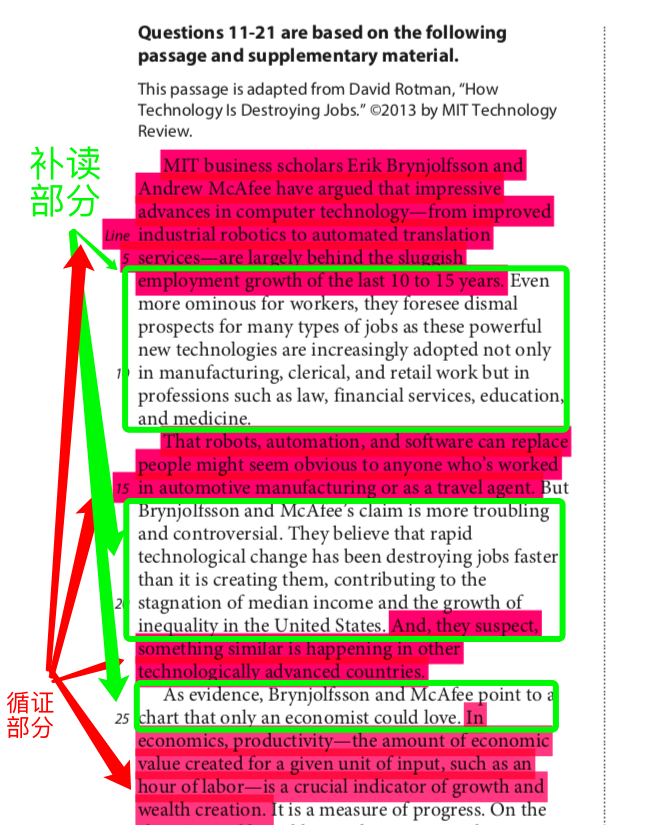

<notice>教程读者请不要直接阅读本文件，因为诸多功能在此无法正常使用，请移步至[程谱 coderecipe.cn](https://coderecipe.cn/learn/10)学习完整教程。如果您喜欢我们的教程，请在右上角给我们一个“Star”，谢谢您的支持！</notice>
Chapter 5 — 文章方法论：科学类文章
======

前言
-----
从这一章开始，我们就正式进入文章方法论的学习了！之前的几章中我们分别将SAT阅读中的几大题型的方法论讲了一遍，现在大家应该对具体的题型解决方法非常熟悉了。接下来，我们就要将点串成线，把知识点的解题方法运用到文章的解决中。在这一章中，我们将看到相同的题型在不同的文章类型中不同的解题顺序和解题方法，但是这一切都是建立在之前题型的基本方法论上的。

到底先读文章还是先做题？
历史双篇文章应该采用怎样的做题顺序？

这些是几乎每一个学生都会问到的问题，相信在这一章中你们会找到想要的答案。

Checkpoint 1 — 科学类文章方法论概述
-----

针对科学类文章，我们的做题原则是通过题目了解文章。在第一讲中，我们会先介绍科学类文章的做题宗旨，做题顺序，和做题原则。

<cr type="player" parameters="XMzg0NDIxMzkxNg=="><notice>播放器功能在此无法正常显示，请移步至[程谱 coderecipe.cn](https://coderecipe.cn/learn/10)查看。</notice></cr>
密码：R301

Checkpoint 2 — 文章示例1
-----

看完抽象的方法论大家可能对科学类文章的做题方法论还并不是完全了解，对于很多同学来讲这都是一种全新的做题方式。一个题型的方法论改起来很快，但是要想改变一个文章的做题顺序却是难上加难。所以不要着急，接下来我们先看一个具体的文章示例。

注意：请大家一定要跟着我一步一步的做完文章，在我让大家读的地方和做的题目一定要暂停视频完成，不然很难真正达到文章示例的效果。

<cr type="player" parameters="XMzg0NDIxNjEwMA=="><notice>播放器功能在此无法正常显示，请移步至[程谱 coderecipe.cn](https://coderecipe.cn/learn/10)查看。</notice></cr>
密码：R302

<cr type="player" parameters="XMzg0NDIxNjM2OA=="><notice>播放器功能在此无法正常显示，请移步至[程谱 coderecipe.cn](https://coderecipe.cn/learn/10)查看。</notice></cr>
密码：R303

Checkpoint 3 — 文章示例2
-----

<cr type="player" parameters="XMzg1Mjg1NTI4NA=="><notice>播放器功能在此无法正常显示，请移步至[程谱 coderecipe.cn](https://coderecipe.cn/learn/10)查看。</notice></cr>
密码：R304

Checkpoint 4 — 文章示例3
-----

<cr type="player" parameters="XMzg1Mjg2MzE4MA=="><notice>播放器功能在此无法正常显示，请移步至[程谱 coderecipe.cn](https://coderecipe.cn/learn/10)查看。</notice></cr>
密码：R305

<cr type="player" parameters="XMzg1Mjg2Mzc4MA=="><notice>播放器功能在此无法正常显示，请移步至[程谱 coderecipe.cn](https://coderecipe.cn/learn/10)查看。</notice></cr>
密码：R306

Checkpoint 5 — 科学类文章总结
-----

在讲完了科学类文章的方法论之后，我们通过三篇具体的文章讲解了科学类文章的具体做题流程。如果大家紧跟着我的思路做完了这三篇文章的话应该对做题原则和做题顺序在具体情况中的应用有了深刻的了解。但是我相信对于刚刚接触一个全新的方法论的同学来讲，肯定还有很多的问题没有得到解答，在下一个视频中，我们将针对一些同学经常会问到的问题进行解答。

—万一文章主旨没有出现在所读到的段落怎么办？
—什么地方该补读，什么地方不该补读呢？

哦对了，介绍一下什么是补读。

当我们读到非循证部分的文章时就叫补读。

如图所示，红色highlight出来的部分就是循证到的部分（这部分可能是循证题，或者是给行号的目的题），绿色框里的是没有题目循证到的部分文章。当我们在读完第一个红色循证区域，也就是1~6行时，不直接看到下一个循证部分而是接着读绿色未循证部分文章的做法叫做补读。补读帮助我们对文章的内容有更清晰，连贯的了解。

<cr type="player" parameters="XMzg1Mjg3ODQ4OA=="><notice>播放器功能在此无法正常显示，请移步至[程谱 coderecipe.cn](https://coderecipe.cn/learn/10)查看。</notice></cr>
密码：R307

