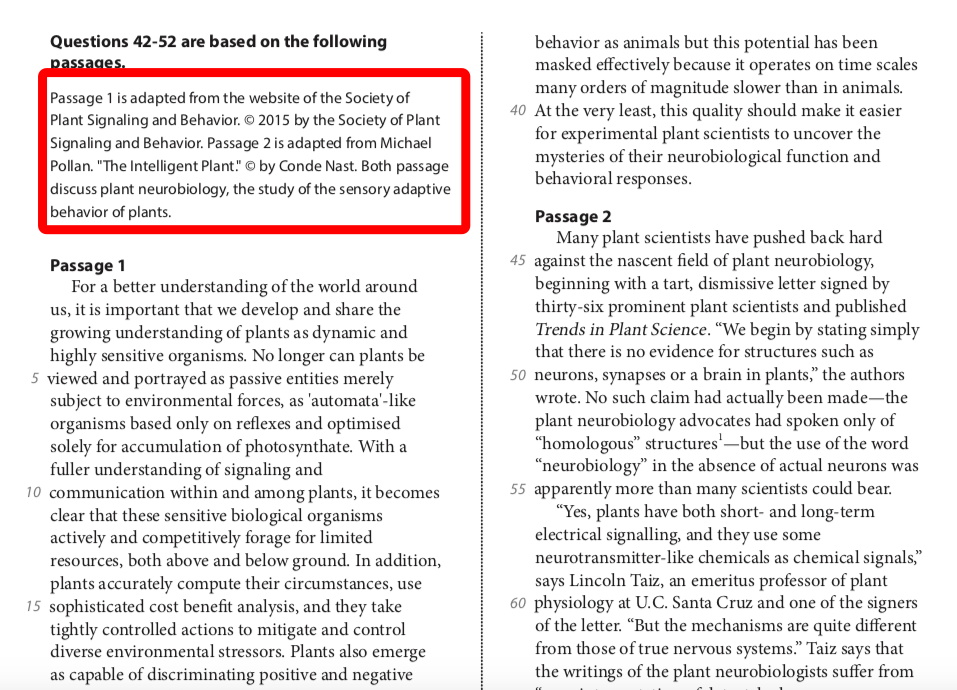
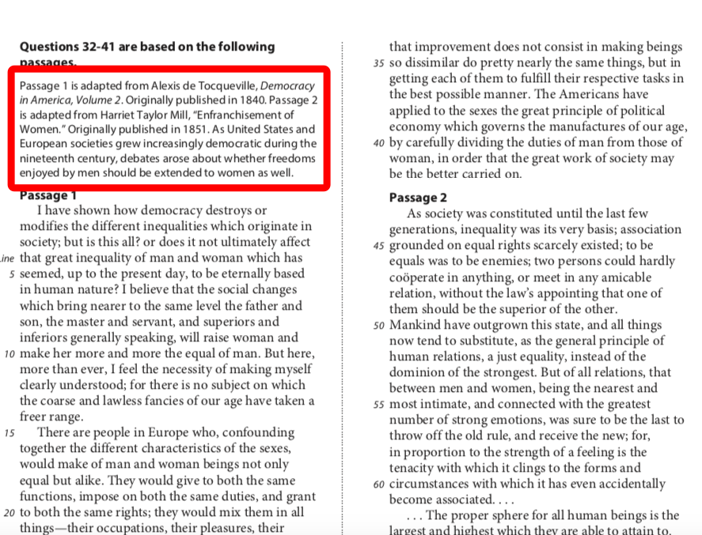
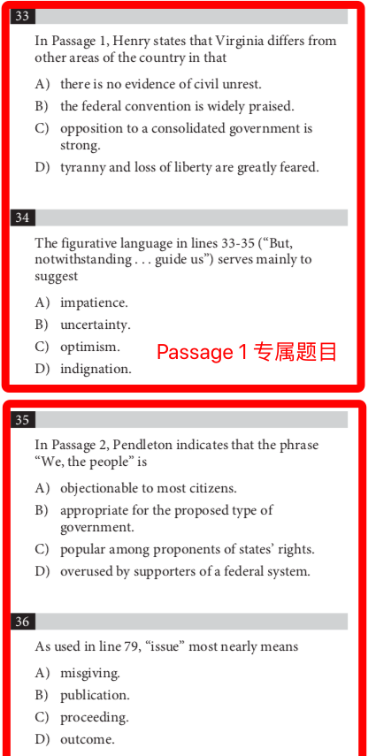
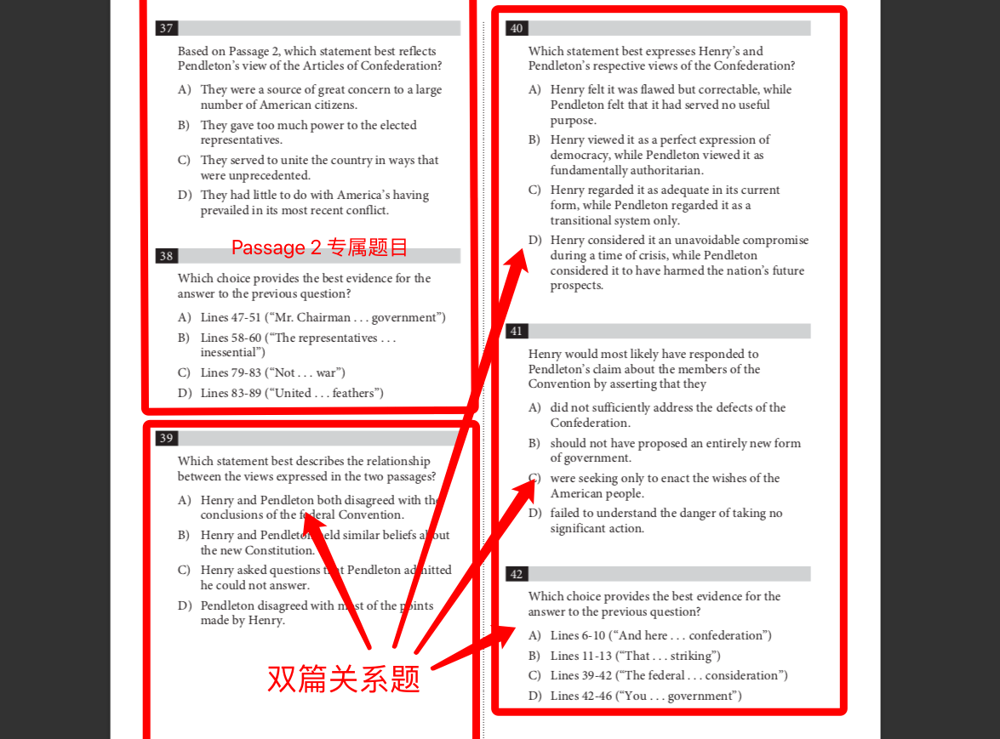

<notice>教程读者请不要直接阅读本文件，因为诸多功能在此无法正常使用，请移步至[程谱 coderecipe.cn](https://coderecipe.cn/learn/10)学习完整教程。如果您喜欢我们的教程，请在右上角给我们一个“Star”，谢谢您的支持！</notice>
Chapter 6 — 双篇文章
======

在学习之前
-----
在大家学习SAT双篇文章解题方法论之前，强烈建议大家先对双篇文章有一些实践接触，这样才更容易与方法产生共鸣，并迅速理解方法论中提到的一些名词或题型。

题目资源
-----
以下是三篇双篇文章题目资源，如果之前不熟悉或没有完成过真正的SAT双篇文章，建议先进行两次实践。

[点击下载题目资源](https://pan.baidu.com/s/1jtHZpVLi0-YLoZ9YZ8AyBg)

Checkpoint 1 — 双篇的文章题材选择
-----
这两篇文章一定是针对一个共同的话题或内容，而观点或角度不同，可能构成对立，互补，部分对立等关系。要想将双篇题目做好，需要清楚的知道每一篇文章的主旨，和两篇文章的主旨有何不同。

在题材上来看，根据以往真题总结，有80%的双篇文章以历史文章为题材，剩下的20%以科学类文章为题材。可从文章前面的背景介绍轻易判断出双篇文章的题材类型。

科学类双篇：

历史类双篇：

虽然题材不同，但是双篇文章考察的题目类型和解题的方法论确实不变的。

Checkpoint 2 — 题型解构
-----
接下来让我们来看一看双篇文章11道题目的构成。双篇文章的出题顺序是：
第一篇文章的对应题目（2-4道）→第二篇文章的对应题目（2-4道）→考察两篇文章联系的题目（3-4道）

历史类双篇：

注意：在可汗学院中出现的历史双篇文章有很多情况题目是完全打乱的，也就是说，第一篇文章的内容，第二篇文章的题目和双篇关系题混在一起，没有严格的顺序，大家一定要注意这种情况在真题中是不会存在的！！在真题中，一定是严格按照我们上面提到的出题顺序出题，这也是我们方法论的主要基础之一（后面视频中会讲到）

Checkpoint 3 — 方法论讲解
-----
<cr type="player" parameters="XMzgzMDEwNjkyMA=="><notice>播放器功能在此无法正常显示，请移步至[程谱 coderecipe.cn](https://coderecipe.cn/learn/10)查看。</notice></cr>

密码：R301

Checkpoint 4 — 示范篇章讲解
-----
刚刚的视频只是进行了抽象的方法论讲解，很多同学对双篇文章的解决方法可能现在还是一头雾水。请不要着急，接下来我会带着大家来做一个双篇文章作为示范。

温馨提示：讲解中默认学生学习过之前的循证题解题方法，目的题解题方法，科学类文章解题方法等，不再重复讲解。

<cr type="player" parameters="XMzgzMDA5MDM5Ng=="><notice>播放器功能在此无法正常显示，请移步至[程谱 coderecipe.cn](https://coderecipe.cn/learn/10)查看。</notice></cr>

密码：R302

Checkpoint 5 — 示范篇章讲解2
-----

跟着我过完了一篇双篇文章后，相信大家已经对方法论有了基本的了解。接下来我们再用另一篇文章进行巩固加深，同时在下面的视频中我会介绍无行号细节题在双篇文章的解题方案。

<cr type="player" parameters="XMzgzMDA5MTUzNg=="><notice>播放器功能在此无法正常显示，请移步至[程谱 coderecipe.cn](https://coderecipe.cn/learn/10)查看。</notice></cr>

密码：R303

Checkpoint 6 — 方法论总结 & FAQ解答
-----

看完了两篇文章，大家一定对双篇文章的解题方法论非常熟悉了，最后我们将进行方法论的总结。并对一些大家经常会问的问题进行解答。比如：

1.	如果出现科学双篇怎么办？解题方法还一样吗？
2.	如何熟悉历史常考背景？
3.	怎么样在短期内快速提升历史类文章的阅读水平？

<cr type="player" parameters="XMzgzMDA5MzExNg=="><notice>播放器功能在此无法正常显示，请移步至[程谱 coderecipe.cn](https://coderecipe.cn/learn/10)查看。</notice></cr>

密码：R304
